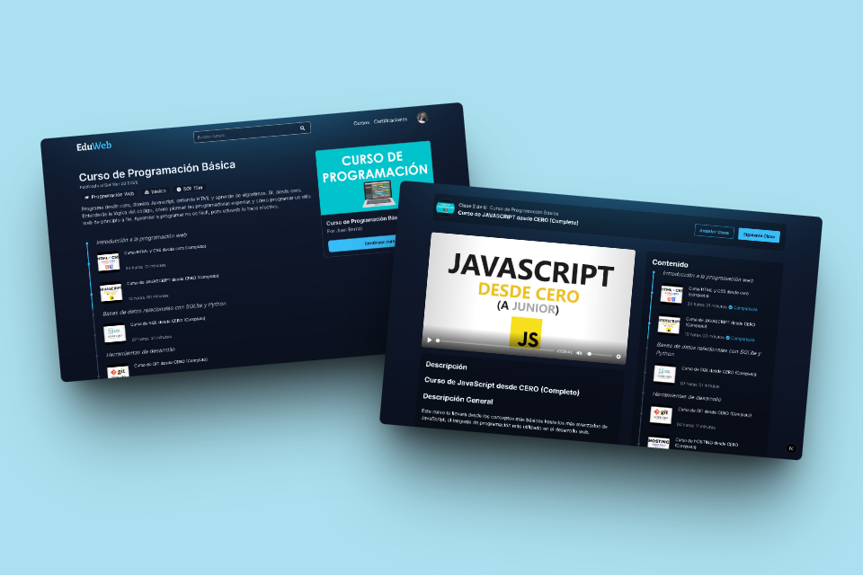
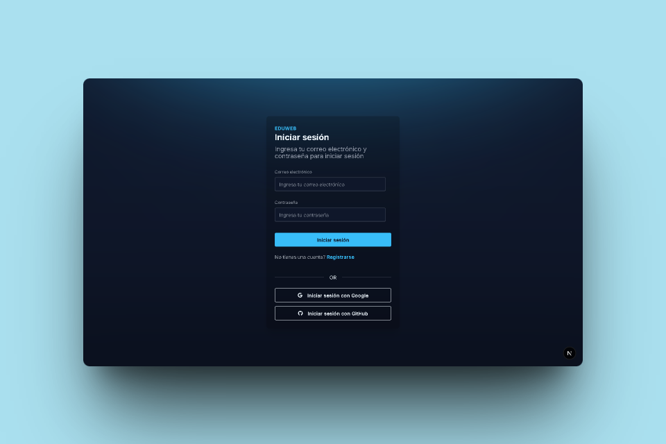
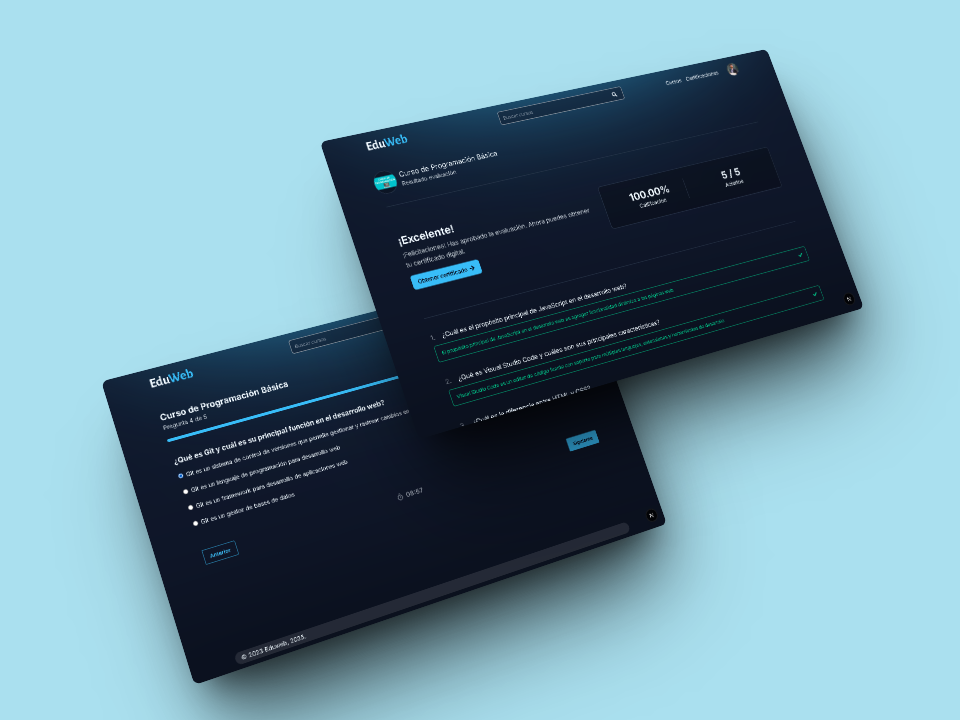
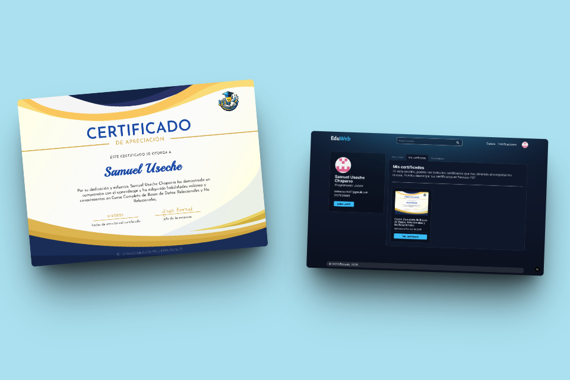
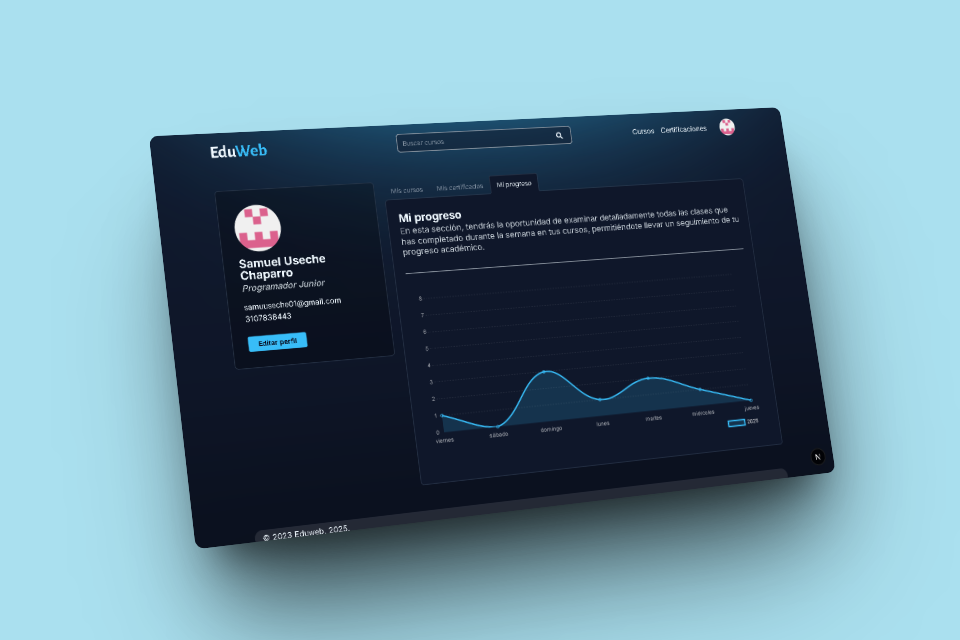
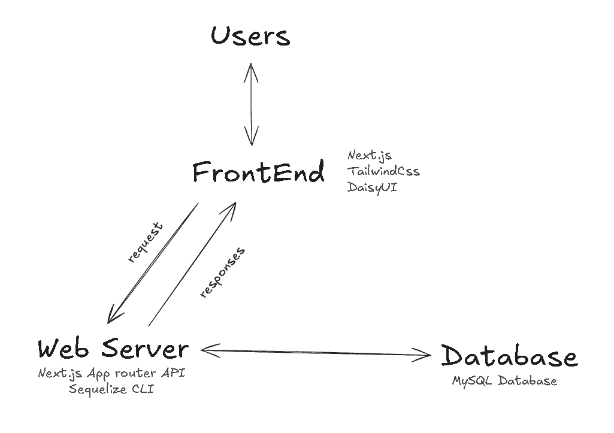

# 🎓 EduWeb - Plataforma Educativa

[English Version](README.md)

[Versión para Teléfonos](https://github.com/AndresGutierrezHurtado/eduweb-mobile)

EduWeb es una plataforma educativa en línea diseñada para facilitar la creación, gestión y consumo de contenido académico. Su enfoque se centra en una experiencia intuitiva para estudiantes y profesores, con herramientas como certificaciones digitales, seguimiento del progreso, exámenes interactivos y visualizaciones gráficas.



## 📑 Tabla de contenido

-   [Características Principales](#-características-principales)
-   [Tecnologías Utilizadas](#-stack-tecnológico)
-   [Arquitectura](#%EF%B8%8F-arquitectura)
-   [Flujos de Usuario](#-flujos-funcionales)
-   [Estructura del Proyecto](#-estructura-del-proyecto)
-   [Instalación y Uso](#%EF%B8%8F-instalación-y-desarrollo)
-   [Contribución](#-contribución)
-   [Contacto](#-contacto)

## 📚 Características Principales

### 🔐 Autenticación y Usuarios

-   Sistema de registro y login con múltiples proveedores (Google, GitHub)
-   Perfiles de usuario personalizables
-   Roles de usuario (Estudiante, Profesor, Administrador)
-   Gestión de permisos y accesos



### 📖 Cursos y Aprendizaje

-   Creación y gestión de cursos
-   Sistema de lecciones y módulos
-   Contenido multimedia (videos, documentos, imágenes)
-   Progreso de aprendizaje y seguimiento
-   Sistema de calificaciones y evaluaciones



### 🎓 Certificados

-   Generación automática de certificados
-   Validación de certificados
-   Historial de certificados por usuario



### 📊 Análisis y Reportes

-   Dashboard con gráficos interactivos
-   Estadísticas de progreso
-   Visualización de datos con Chart.js



### 🖥️ Interfaz de Usuario

-   Diseño responsivo y moderno
-   Funcionalidades de arrastrar y soltar
-   Navegación intuitiva

## 🚀 Stack Tecnológico

**Frontend**:

-   Next.js 14 (App Router)
-   React 19
-   Tailwind CSS V4
-   DaisyUI
-   Chart.js para visualizaciones
-   React Beautiful DnD
-   Plyr para reproductores de video
-   Valibot para validación de formularios

**Backend**:

-   MySQL con Sequelize-cli ORM
-   NextAuth para la auntenticacion

## 🏗️ Arquitectura



-   El cliente (Next.js) se comunica con la API REST
-   La API maneja la lógica y realiza consultas mediante el ORM Sequelize a la base de datos MySQL

## 🔄 Flujos funcionales

### 👤 Usuario

**Registro y autenticación**

-   Registro de usuario con validación de datos.
-   Autenticación con opciones de recuperación de contraseña.

**Visualización de cursos disponibles**

-   Filtrado y búsqueda de cursos por categoría.
-   Visualización de detalles del curso (descripción, duración, etc.).

**Desarrollo del curso**

-   Creación de contenido interactivo.
-   Guardado automático del progreso.
-   Visualización del progreso del curso.

**Descarga de certificado**

-   Generación automática de certificado al completar el curso.
-   Opción de descarga en diferentes formatos (PDF, imagen).

**Validación de certificado**

-   Proceso de verificación en línea para terceros.

**Edición de perfil**

-   Actualización de información personal y preferencias.
-   Opción de cambiar contraseña y configuración de privacidad.

### 👨‍🏫 Profesor

**Acceso al panel de cursos**

-   Visualización de cursos asignados y su estado.

**Gestión de cursos**

-   Creación y edición de cursos.
-   Análisis de rendimiento de los estudiantes.

### 👨‍💼 Admin

**Acceso al panel de administración**

-   Visualización de estadísticas de usuarios y cursos.

**Gestión de información de usuarios**

-   Edición y eliminación de cuentas de usuario.
-   Monitoreo de actividad de usuarios.

## 🛠️ Instalación y Desarrollo

1. Clonar el repositorio:

    ```bash
    git clone https://github.com/AndresGutierrezHurtado/eduweb.git
    cd eduweb
    ```

2. Instalar dependencias:

    ```bash
    npm install
    ```

3. Crear la base de datos en PHPMyAdmin:

    ```SQL
    CREATE DATABASE `eduweb`;
    ```

4. Copiar el archivo `.env.example` a `.env` y configurar las variables de entorno:

    ```bash
    cp .env.example .env
    ```

5. Ejecutar migraciones de Sequelize:

    ```bash
    npm run db:migrate && npm run db:seed
    ```

6. Iniciar el servidor de desarrollo:

    ```bash
    npm run dev
    ```

7. Acceder a la aplicación:
    - Abre tu navegador y dirígete a `http://localhost:3000` para ver la aplicación en funcionamiento.

## 📊 Estructura del Proyecto

```
eduweb/
├── public/                         # Archivos estáticos
│   └── certificates/               # Certificados almacenados
└── src/
    ├── app/                        # Rutas de la aplicación (App Router)
    │   ├── api/                    # Endpoints de la API
    │   └── api-docs/               # Documentación de la API
    │
    ├── components/                 # Componentes reutilizables de React
    ├── hooks/                      # Custom Hooks
    ├── lib/                        # Utilidades y configuraciones
    ├── layouts/                    # Layouts de la aplicación
    └── database/                   # Configuración de base de datos para Sequelize (ORM)
        ├── models/                 # Modelos de Sequelize
        ├── migrations/             # Migraciones de Sequelize
        └── seeds/                  # Datos semilla (Seeds) de Sequelize
```

## 🤝 Contribución

1. Haz un fork del repositorio
2. Crea tu rama: `git checkout -b feature/nueva-funcionalidad`
3. Haz commit: `git commit -m "Agrega X"`
4. Push: `git push origin feature/nueva-funcionalidad`
5. Abre un Pull Request

## 📞 Contacto

Para soporte o consultas, por favor contacta a:

-   Andrés Gutiérrez Hurtado
-   Correo Electrónico: [andres52885241@gmail.com](mailto:andres52885241@gmail.com)
-   LinkedIn: [Andrés Gutiérrez Hurtado](https://www.linkedin.com/in/andr%C3%A9s-guti%C3%A9rrez-hurtado-25946728b/)
-   GitHub: [@AndresGutierrezHurtado](https://github.com/AndresGutierrezHurtado)
-   Portfolio: [Link portfolio](https://andres-portfolio-b4dv.onrender.com)
