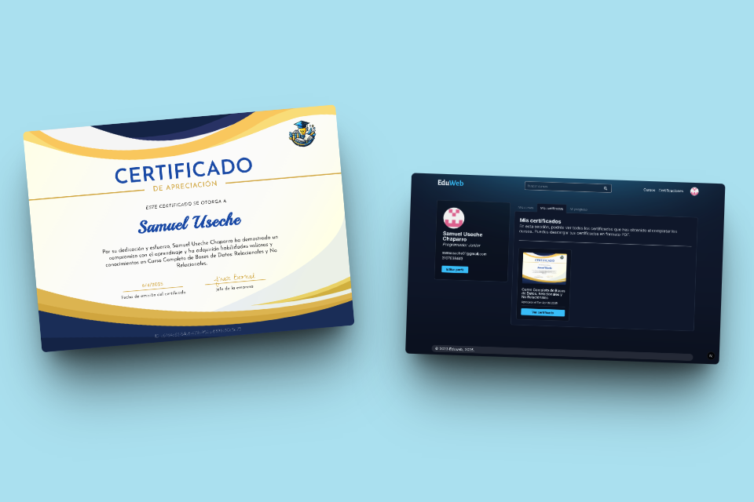
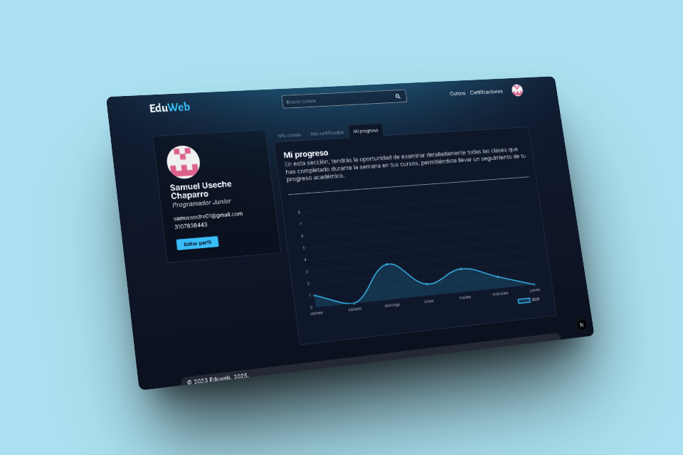
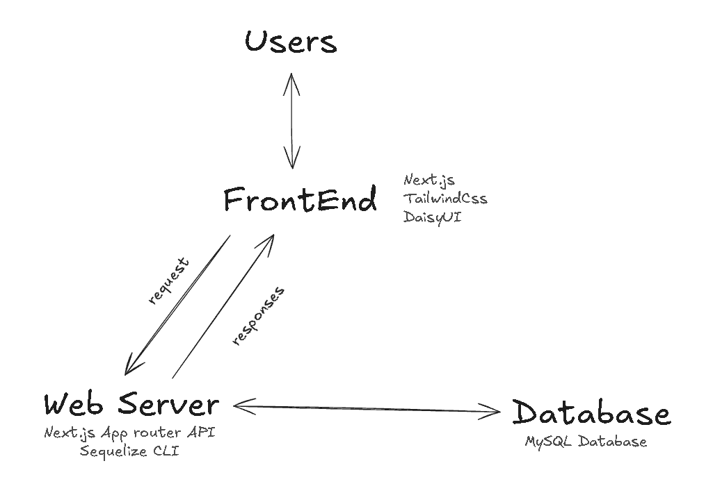

# 🎓 EduWeb - Educational Platform

[Versión en Español](README.es.md)

[Mobile Version](https://github.com/AndresGutierrezHurtado/eduweb-mobile)

EduWeb is an online educational platform designed to facilitate the creation, management, and consumption of academic content. Its focus is on providing an intuitive experience for students and teachers, with tools such as digital certifications, progress tracking, interactive exams, and graphical visualizations.


## 📑 Table of Contents

-   [Main Features](#-main-features)
-   [Technologies Used](#-technology-stack)
-   [Architecture](#️-architecture)
-   [User Flows](#-user-flows)
-   [Project Structure](#-project-structure)
-   [Installation and Usage](#️-installation-and-development)
-   [Contribution](#-contribution)
-   [Contact](#-contact)

## 📚 Main Features

### 🔐 Authentication and Users

-   Registration and login system with multiple providers (Google, GitHub)
-   Customizable user profiles
-   User roles (Student, Teacher, Administrator)
-   Management of permissions and access


### 📖 Courses and Learning

-   Creation and management of courses
-   Lesson and module system
-   Multimedia content (videos, documents, images)
-   Learning progress and tracking
-   Grading and evaluation system


### 🎓 Certificates

-   Automatic certificate generation
-   Certificate validation
-   Certificate history by user



### 📊 Analysis and Reports

-   Dashboard with interactive graphs
-   Progress statistics
-   Data visualization with Chart.js



### 🖥️ User Interface

-   Responsive and modern design
-   Drag-and-drop functionalities
-   Intuitive navigation

## 🚀 Technology Stack

**Frontend**:

-   Next.js 14 (App Router)
-   React 19
-   Tailwind CSS V4
-   DaisyUI
-   Chart.js for visualizations
-   React Beautiful DnD
-   Plyr for video players
-   Valibot for form validation

**Backend**:

-   MySQL with Sequelize-cli ORM
-   NextAuth for authentication

## 🏗️ Architecture



-   The client (Next.js) communicates with the REST API
-   The API handles the logic and queries the MySQL database using the Sequelize ORM

## 🔄 User Flows

### 👤 User

**Registration and Authentication**

-   User registration with data validation.
-   Authentication with password recovery options.

**Viewing Available Courses**

-   Filtering and searching for courses by category.
-   Viewing course details (description, duration, etc.).

**Course Development**

-   Creation of interactive content.
-   Automatic progress saving.
-   Viewing course progress.

**Certificate Download**

-   Automatic certificate generation upon course completion.
-   Download option in different formats (PDF, image).

**Certificate Validation**

-   Online verification process for third parties.

**Profile Editing**

-   Updating personal information and preferences.
-   Option to change password and privacy settings.

### 👨‍🏫 Teacher

**Access to Course Panel**

-   Viewing assigned courses and their status.

**Course Management**

-   Creation and editing of courses.
-   Analysis of student performance.

### 👨‍💼 Admin

**Access to Administration Panel**

-   Viewing statistics of users and courses.

**User Information Management**

-   Editing and deleting user accounts.
-   Monitoring user activity.

## 🛠️ Installation and Development

1. Clone the repository:

    ```bash
    git clone https://github.com/AndresGutierrezHurtado/eduweb.git
    cd eduweb
    ```

2. Install dependencies:

    ```bash
    npm install
    ```

3. Create the database in PHPMyAdmin:

    ```SQL
    CREATE DATABASE `eduweb`;
    ```

4. Copy the `.env.example` file to `.env` and configure the environment variables:

    ```bash
    cp .env.example .env
    ```

5. Run Sequelize migrations:

    ```bash
    npm run db:migrate && npm run db:seed
    ```

6. Start the development server:

    ```bash
    npm run dev
    ```

7. Access the application:
    - Open your browser and go to `http://localhost:3000` to see the application in action.

## 📊 Project Structure
```
eduweb/
├── public/                         # Static files
│   └── certificates/               # Stored certificates
└── src/
    ├── app/                        # Application routes (App Router)
    │   ├── api/                    # API endpoints
    │   └── api-docs/               # API documentation
    │
    ├── components/                 # Reusable React components
    ├── hooks/                      # Custom Hooks
    ├── lib/                        # Utilities and configurations
    ├── layouts/                    # Application layouts
    └── database/                   # Database configuration for Sequelize (ORM)
        ├── models/                 # Sequelize models
        ├── migrations/             # Sequelize migrations
        └── seeds/                  # Sequelize seed data
```

## 🤝 Contribution

1. Fork the repository
2. Create your branch: `git checkout -b feature/new-feature`
3. Commit: `git commit -m "Add X"`
4. Push: `git push origin feature/new-feature`
5. Open a Pull Request

## 📞 Contact

For support or inquiries, please contact:

-   Andrés Gutiérrez Hurtado
-   Email: [andres52885241@gmail.com](mailto:andres52885241@gmail.com)
-   LinkedIn: [Andrés Gutiérrez Hurtado](https://www.linkedin.com/in/andr%C3%A9s-guti%C3%A9rrez-hurtado-25946728b/)
-   GitHub: [@AndresGutierrezHurtado](https://github.com/AndresGutierrezHurtado)
-   Portafolio: [Link portfolio](https://andres-portfolio-b4dv.onrender.com)
